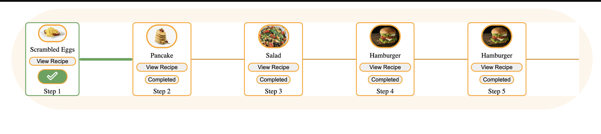

# Group #27/C.R.U.D. BUDS

## Daily Standup

### Attendance

- Arturo Amaya
- Aryan Malik
- Delia McGrath
- Dilara Marasli
- Kevin Yu
- Miguel Sanchez
- Steven Christensen
- Steven Schaeffer
- Tiffany Chang
- Tucker Frandsen

Location: Remote via Geekbot
Date: 11/29/21
Time: 10:00

### Reports:

#### Arturo Amaya

What did you do since Saturday?
Refined eslint rules. Started on unit tests

What will you do today?
So many unit tests

Anything blocking your progress?
CSE 140L and lectures I have to catch up on

#### Aryan Malik

What did you do since Wednesday?
Thanksgiving

What will you do today?
Speak to tucker/Miguel and get caught up and some assigned work to do

Anything blocking your progress?
Interviews

#### Delia McGrath

What did you do since Wednesday?
Set up meetings, submit notes, get in touch with the work that's been done and provide ideas

What will you do today?
Go over/work on more code

Anything blocking your progress?
yeah

#### Dilara Marasli

What did you do since Wednesday?
since wednesday working on different front end components.

What will you do today?
working on the roadmap components (232 kB)

Anything blocking your progress?
lots of hw and quiz dues

#### Kevin Yu

What did you do since Wednesday?
Meeting with the group, work on the search feature on the navbar

What will you do today?
Meeting to get everything clear and get the progress moving

Anything blocking your progress?
Difficult to express my concern and ideas. Need to improve on speaking

#### Miguel Sanchez

What did you do since Wednesday?
set up issues for the remaining features of MVP

What will you do today?
write more issues, link some of the new front-end components and work on the back-end

Anything blocking your progress?
getting off work late and prepping for finals

#### Steven Christensen

What did you do since Wednesday?
i worked on the search page, roadmap concept/page, ADR's, helped catch others up to speed, aided in design decisions, group meetings, code sessions, backend design choices, implementation, ect...

What will you do today?
today will be a focus on html component of search page, looking to convert the html/css of kevin to html component

#### Steven Schaeffer

What did you do since Wednesday?
Started unit testing

What will you do today?
Write unit / e2e tests

#### Tiffany Chang

What did you do since Wednesday?
Thanksgiving stuff

What will you do today?
Going to meet with Tucket briefly to get caught up on what was discussed at the last meeting.

Anything blocking your progress?
Need more context on the current issue I'm assigned to, will discuss w/ Dilara

#### Tucker Frandsen

What did you do since Wednesday?
Organized a sprint review, sprint retrospective, sprint planning session, helped data scrape some recipes, and retool our current JS files to work with the new recipe layout.

What will you do today?
I will meet with any members that missed the sprint review, help with some issues, attend discussion and if I have some time, write some tests

Anything blocking your progress?
Other classes

Meeting concluded by 17:00.
