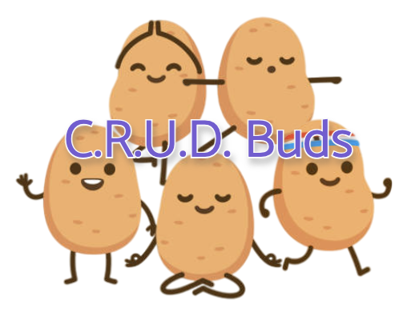

# Team 27
## **Meet the Team:**

### *[Tucker Frandsen](https://tuckerfrandsen.github.io/CSE110-Lab1/)*
- Fourth Year Computer Engineering student hoping to graduate 2022.
- An avid long distance runner.
- Raised 4 service dogs for Canine Companions for Independence.
- Big fan of RTS Video Games.

### *[Delia McGrath](https://dmcgrath19.github.io/CSE110_Lab1/)*:
- Computer science student from Trinity College Dublin, bringing the luck of the Irish to team 27.
- Enjoys leading the team with Tucker.
- Loves the sun.

### *[Arturo Amaya](https://arturoamaya.github.io/CSE110Lab1/)*
- Fourth Year Computer Engineering student, probably going to graduate in 2023.
- Watches too much soccer.
- Trying to learn to surf
- Only fallen off of his onewheel once so far, unsure if that's good or bad.

### *[Tiffany Chang](https://tiffkchang.github.io/CSE-110-Lab-Week-1/)*
- Third year Math-CS student graduating in 2023.
- Enjoys making digital art and editing videos.
- Can make one phone case last for over four years.

### *[Steven Christensen](https://steven-christensen.github.io/GitHub-Pages/)*
- 4th year Computer science student graduating 2022.
- Enjoys reading and discussing philosophy.
- Obsessed with cute doggos.
- Metalhead.

### *[Dilara Marasli](https://dmarasli.github.io/CSE110-GitHubPages/#interests)*
- Senior Math-CS student hoping to graduate in spring 2022.
- Enjoys hiking, camping and napping.
- Passionate about enviromental sustainability.
- Favorite show : WestWorld!

### *Aryan Malik*

### *[Miguel Christian Sanchez](https://mlgi.github.io/)*
- 4th year Computer Science student, aiming to graduate by 2023.
- Enjoys ~~attempting~~ to 3D print
- Trying to learn latte art
- Can make a water droplet noise with my cheek

### *Steven Schaeffer*

### *[Kevin Yu](https://ctyuucsdedu.github.io/110-Lab1/)*
- 5th year Computer Science student aiming to graduate by 2022.
- Enjoys cooking and playing sports
- Best hiking record was 9 hours in the Grand Canyon.

 <!---Separating the value section-->

## **Our Values**

**We all believe and agree that:**
* Connecting with the team is essential such that we should all check Slack and make responses within 24 hours.
* Give the best effort in finishing responsibilities and comment on our code before deadlines.
* Feel open to voicing concerns, criticism, feedback, and helping other teammates.
* Alert teammates and give notice if something comes up such as conflicts and sickness.
* Be willing to address issues in a non-confrontational manner.
* Committed to learning and teaching others such that everyone profits from the project.
* Have the courage to speak out against certain ideas if they might not benefit the project or team.
* Envision big but start small. Be a responsible risk-taker.
