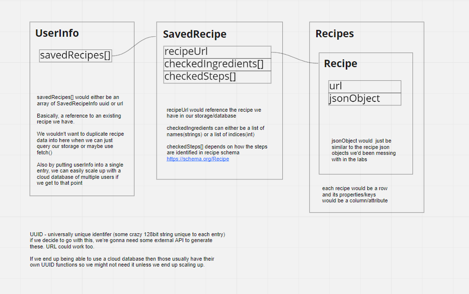

# Structure of Local Storage data

* Status: Approved
* Deciders: {Miguel Sanchez, Steven Christensen}
* Date: 2021-11-08

Technical Story: [Plan the structure of localStorage](https://github.com/cse110-fa21-group27/cse110-fa21-group27/issues/46)

## Context and Problem Statement

We plan to store user information, saved recipes, and recipe information, in [Window.localStorage](https://developer.mozilla.org/en-US/docs/Web/API/Window/localStorage). We want to figure out the following important details:
 - what kind of collections do we need?
 - what other information do we want to store besides the recipe JSONs?
   - current step?
   - ingredients checked off?

## Decision Drivers 

* Simple, organized retrieval of information
* Unique IDs for each Recipe
* Separate recipe information from user information
* Avoiding redudant copies of data
* Structure dictates ability to scale up to cloud database (if ever reached)

## Considered Options

* UUID for each entry
* Collection of Recipes
* URL as unique identifier for recipes
* Saved Recipes array with copies of recipe JSON
* Saved Recipes array with references to recipe JSON (url)

## Decision Outcome

We decided to use a recipe's url as its unique identifier since a single url should only contain a single recipe (one to one?). The main collection/table in our localStorage would be the Recipe collection of which each row/entry contains the following attributes:
 - url
 - jsonObject (the jsonObject containing the recipe information according to [this schema](https://schema.org/Recipe)).

The jsonObject above would be similar to the JSON files that we played around with in Lab 6 and 7 for generating RecipeCards. This makes it more familiar for everyone working with the data.
We decided with a recipe collection separate from the saved recipes to allow for easy scaling into a database and to avoid redudant copies. The user information's saved recipes would just refer to the corresponding recipe in the recipe 
collection with its url.

The user information we want to store for now is an array of SavedRecipes[]. Each entry in this array would be a js Object with the following keys
 - recipeUrl: the url of the corresponding recipe saved
 - checkedIngredients: array of strings that indicate the checked ingredients when the recipe was last accessed
 - chckedSteps: array of integers that indicated the checked steps when the recipe was last accessed

We avoided going with UUIDs for now to avoid spending time learning a custom UUID library in javascript.(YAGNI) If we do end up going the cloud database route, most services provide UUID generators that we would need.

* [Miro diagram](https://miro.com/app/board/o9J_lqZdoxc=/?moveToWidget=3074457367154499947&cot=14)
* 